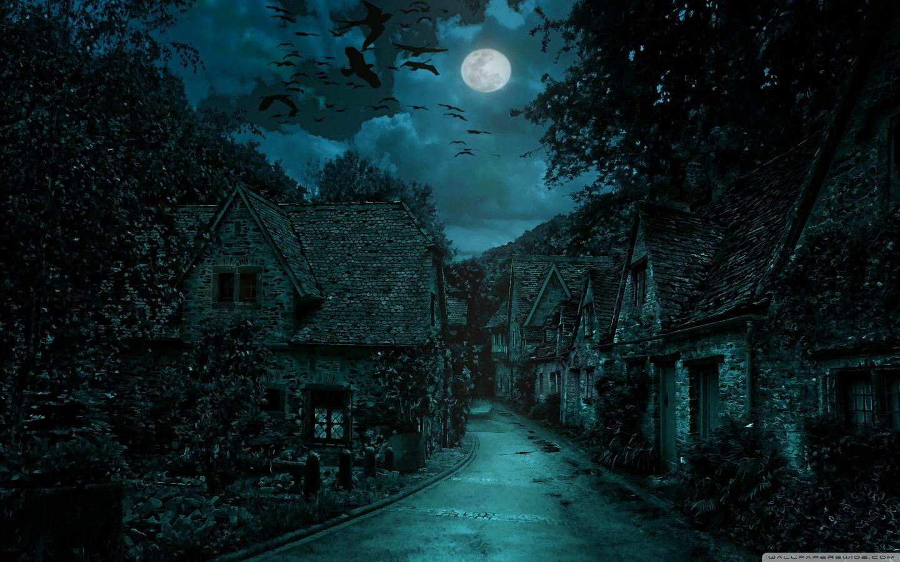

# Desktop Wallpaper Collection

Welcome to Desktop Wallpaper Collection

This repository contains a collection of wallpapers for desktop use. The wallpapers are organized into different categories to make it easy to find and use them.

---

Preview:

## About This Project

This project is a simple wallpaper library that includes various styles such as:

- Moody night wallpapers  
- Nature and landscape wallpapers  
- Dark and aesthetic wallpapers  
- Minimal wallpapers  

The goal of this project is to provide high-quality wallpapers that can be used for personal desktop customization.

---

## How to Use

1. Clone or download this repository  
2. Open the wallpaper folder you want  
3. Choose any image you like  
4. Set it as your desktop background  

---

## Purpose

This repository is created for:

- Organizing wallpaper collections  
- Sharing wallpapers with others  
- Practicing Git and GitHub workflow  
- Building a simple open-source project  

---

## Contributing

If you want to contribute:

- Add new wallpapers  
- Improve folder structure  
- Keep images high quality  

You can create a pull request.

---

## License

This project is for personal use.  
Do not resell or redistribute the wallpapers commercially.

---

## Author

Created and maintained by the repository owner.
